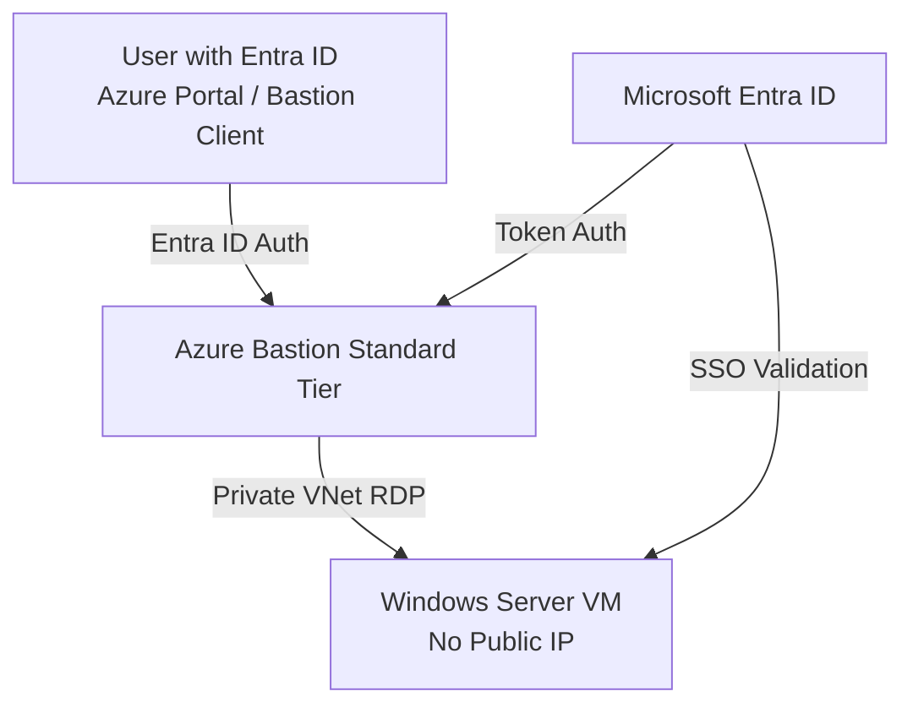

# Bastion-Windows-RDP-using-EntraID-To-Authenticate


Perfect — let’s walk through the **full end-to-end setup**:
creating a **Windows VM** (with **no public IP**), enabling **Microsoft Entra ID login**, and connecting via **Azure Bastion** — all while keeping the environment **fully private and secure**.

---

## 🏗️ **High-Level Architecture**



---

## ⚙️ **Step 1 – Create Resource Group**

```bash
az group create \
  --name MyRG \
  --location eastus
```

---

## 🌐 **Step 2 – Create Virtual Network and Subnets**

You need two subnets:

* `AzureBastionSubnet` (mandatory name)
* `MyVMSubnet` for the VM

```bash
az network vnet create \
  --resource-group MyRG \
  --name MyVNet \
  --address-prefix 10.0.0.0/16 \
  --subnet-name MyVMSubnet \
  --subnet-prefix 10.0.1.0/24
  --subscription [SUBSRIPTION]

az network vnet subnet create `
  --resource-group MyRG `
  --vnet-name MyVNet `
  --name AzureBastionSubnet `
  --address-prefix 10.0.2.0/27 `
  --subscription [SUBSRIPTION]
```

---

## 🧱 **Step 3 – Create Network Security Group**

Allow only internal network access (no inbound RDP):

```bash
az network nsg create \
  --resource-group MyRG \
  --name MyVM-NSG

# Allow Azure Bastion subnet inbound (no RDP from internet)
az network nsg rule create `
  --resource-group MyRG `
  --nsg-name MyVM-NSG `
  --name AllowAzureBastion `
  --priority 100 `
  --direction Inbound `
  --access Allow `
  --protocol Tcp `
  --source-address-prefix AzureBastionSubnet `
  --destination-port-range 3389 `
  --subscription [SUBSRIPTION]
```

---

## 💻 **Step 4 – Create Network Interface (No Public IP)**

```bash
az network nic create `
  --resource-group MyRG `
  --name MyVMNic `
  --vnet-name MyVNet `
  --subnet MyVMSubnet `
  --network-security-group MyVM-NSG `
  --subscription [SUBSRIPTION]
```

---

## 🪟 **Step 5 – Create the Windows VM (Private Only)**

Use the NIC, disable public IP, and enable Entra ID extension later.

```bash
az vm create `
  --resource-group MyRG `
  --name MyVM `
  --nics MyVMNic `
  --image Win2022Datacenter `
  --admin-username azureuser `
  --admin-password "StrongP@ssw0rd!" `
  --size Standard_B2s `
  --no-wait `
  --public-ip-address "" `
  --license-type Windows_Server `
  --assign-identity `
  --subscription [SUBSRIPTION]
```

> ⚠️ The `--public-ip-address ""` flag ensures **no public IP** is created.

---

## 🔑 **Step 6 – Enable Microsoft Entra ID Login**

Install the **Azure AD Login for Windows extension**:

```bash
az vm extension set `
  --publisher Microsoft.Azure.ActiveDirectory `
  --name AADLoginForWindows `
  --resource-group MyRG `
  --vm-name MyVM `
  --subscription [SUBSRIPTION]
```

---

## 👥 **Step 7 – Assign Entra Role to Users**

Assign one of the following roles:

* `Virtual Machine Administrator Login` (admin)
* `Virtual Machine User Login` (standard user)

```bash
az role assignment create `
  --assignee user@domain.com `
  --role "Virtual Machine Administrator Login" `
  --scope $(az vm show --name MyVM --resource-group MyRG --query id -o tsv) `
  --subscription [SUBSRIPTION]
```

---

## 🧰 **Step 8 – Deploy Azure Bastion**

```bash
az network public-ip create `
  --resource-group MyRG `
  --name MyBastionPIP `
  --sku Standard `
  --allocation-method Static `
  --subscription [SUBSRIPTION]

az network bastion create `
  --name MyBastion `
  --public-ip-address MyBastionPIP `
  --resource-group MyRG `
  --vnet-name MyVNet `
  --sku Standard `
  --subscription [SUBSRIPTION]
```

> The Bastion service gets a **public IP**, but **the VM remains private**.

---

## 🧭 **Step 9 – Connect via Bastion**

1. Go to **Azure Portal → Virtual Machines → MyVM → Connect → Bastion**
2. Choose **Authentication Type: Microsoft Entra ID**
3. Click **Connect**
4. Sign in using your **Entra credentials**
   (MFA or Conditional Access applies automatically)

---

## 🏠 **Optional: Private Bastion (No Public IP at All)**

If your enterprise has **VPN or ExpressRoute**, you can deploy **Private Bastion**:

```bash
az network bastion create `
  --name MyPrivateBastion `
  --resource-group MyRG `
  --vnet-name MyVNet `
  --sku Standard `
  --enable-tunneling true `
  --enable-ip-connect true `
  --public-ip-address "" `
  --subscription [SUBSRIPTION]
```

Then use the Azure CLI Bastion tunnel to RDP:

```bash
az network bastion rdp `
  --name MyPrivateBastion `
  --resource-group MyRG `
  --target-resource-id $(az vm show -g MyRG -n MyVM --query id -o tsv) `
  --subscription [SUBSRIPTION]
```

---

## 🧠 **Best Practices Summary**

| Category       | Recommendation                                          |
| -------------- | ------------------------------------------------------- |
| **Security**   | Disable all inbound RDP rules; use Bastion only         |
| **Identity**   | Use Entra ID roles & MFA enforcement                    |
| **Monitoring** | Enable Azure Monitor & Log Analytics for login activity |
| **Networking** | Keep VM in private subnet with NSG isolation            |
| **Operations** | Use Bastion SSO and remove local admin accounts         |

---

